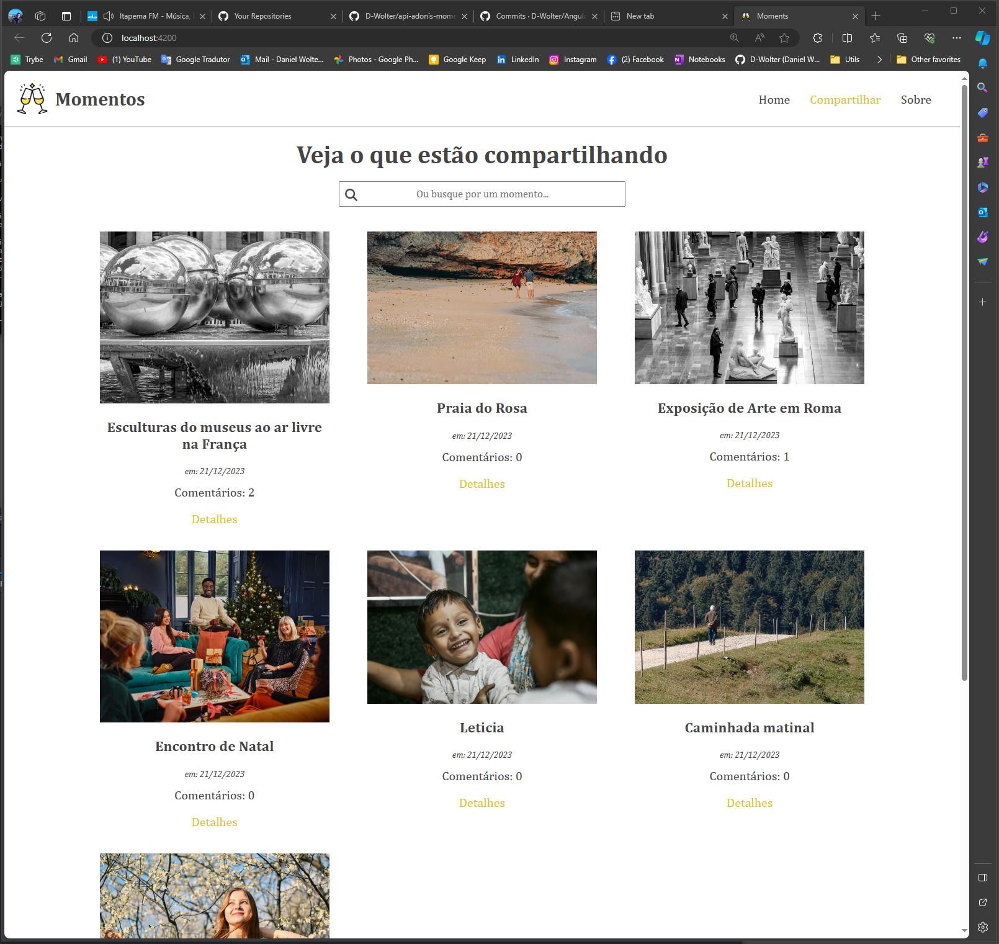

Curso de Angular do canal do youtube Hora de Codar com o Matheus Battisti
https://www.youtube.com/watch?v=vJt_K1bFUeA&list=PLnDvRpP8Bnex2GQEN0768_AxZg_RaIGmw&index=1

Projetos Moments em Angular,
É nescessário iniciar a aplicação back end para esse projeto consumir,

Aplicação Back-end Momens em Adonis.
https://github.com/D-Wolter/api-adonis-moment-backend,

Para rodar aplicação front-end,

npm install,
ng serve,

